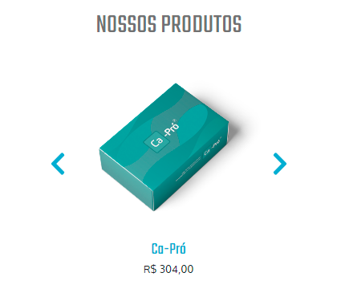

# BSConsult test
### Choose Language: [PT-BR](#portuguese-brazil) | [EN](#english)
---
## English

That project was a test passed to me by BSConsult, and unfortunately I don't was approved, but the test code(code with problems) is on **_fail-code_** folder.
>The code for this test was created with **HTML+JS+CSS**.

But after finishing, I decided to redo the entire project just for training, only this time I used **React Hooks**, **Typescript** and the **BEM** methodology, but I didn't follow 100% of the rules of this methodology because it's my first code using it.
>I really liked what I saw, that is the first methodology I used and I already felt good advantages when using it.

This test I was given was for the front-end and with just one page, but it's ***not 100% functional***. Bellow I'll leave information about what works.

### Main menu ***products*** buttons open a submenu

### In this submenu it's possible open another submenu by clicking on ***Multi-Bari***:

### We can see these details in **mobile** version too:
#### ***Products*** button:

#### ***Multi-Bari*** button:

### The first products section in mobile version is a slider:

### About us section has a ***read more*** button to extend the text

> When this text is extended, the ***read more*** button becomes ***hide*** to hide a part of the text:

### The second products section has two different slider shapes:
#### **Desktop** version:

#### **Mobile** version:

## Those are the only functional things on the page.

### The page is also responsive, so if you want to test this and the other things just [Click Here](https://satuctkode.github.io/BSConsult-test/).

---
## Portuguese Brazil

Este projeto foi um teste passado para mim pela BSConsult, e infelizmente eu acabei não sendo aprovado, mas o código do teste(que está com problemas) está na pasta **_fail-code_**.
>O código deste teste foi criado com **HTML+JS+CSS**.

Mas depois eu acabei resolvendo refazer todo o projeto do teste apenas para treinar, só que dessa vez eu usei **React Hooks**, **Typescript** e a metodologia **BEM**, mas eu não segui 100% das regras dessa metodologia por conta de ser meu primeiro código utilizando ela.
>Eu gostei muito do que vi, essa é a primeira metodologia que usei e já senti boas vantagens ao utiliza-la.

Este teste que me foi passado foi para front-end e com apenas uma página, mas ela ***não é 100% funcional***. Logo abaixo deixarei informações do que funciona.

### Botão ***produtos*** do menu principal abre um submenu:

### Nesse submenu é possível abrir mais um submenu clicando no ***Multi-Bari***:

### Podemos ver esses detalhes na versão **mobile** também:
#### Botão ***produtos***:

#### Botão ***Multi-Bari***:

### A primeira seção de produtos na versão **mobile** é um slider:

### A seção **sobre nós** tem um botão ***ler mais*** para extender o texto:

> Quando esse texto é extendido, o botão ***ler mais*** se torna ***ocultar*** para esconder uma parte do texto:

### A segunda seção de produtos tem duas formas diferentes de slider:
#### Versão **desktop**:

#### Versão **mobile**:

## Essas são as únicas coisas funcionais na página.

### A página também é responsiva, então se você quiser testar isso e as outras coisas é só [Clicar Aqui](https://satuctkode.github.io/BSConsult-test/).
